# gnsa-mobile-audit-execution

# Table of Contents

* [Android build](#android-build)  
* [iOS build](#ios-build)  
* [Upload file to your stage environment](#upload-file-to-your-stage-environment)

# Android build

## Prerequisites

* Node 12
* Android Studio 

## Install dependencies

From the root folder of the project, run:

```sh
yarn install
```

or

```sh
npm install
```
depending on your package manager.

## Select target environment for the build (DEV1, DEV2, QA, etc.)

Open the project from `android` folder in Android Studio.

From the `Build` tab, hit `Select Build Variant...` option:

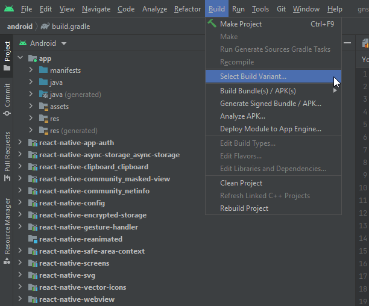

After that appropriate menu will be shown. For the module `:app`, select release variant of the target environment (e.g. `dev1Release`, `dev2Release`, `qaRelease`, etc.).

For adding new environments refer to https://git.daimler.com/GNSA/gnsa-mobile-audit-execution/pull/33

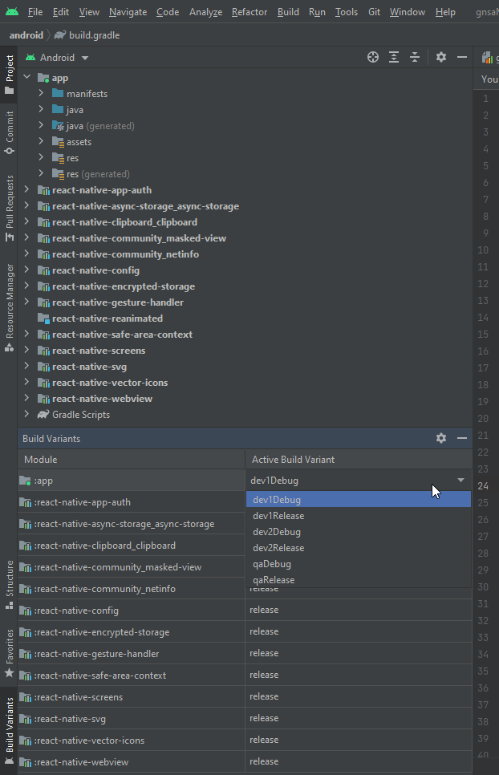


## Build APK file

From `Build` tab, hit `Build Bundle(s) / APK(s)` option and then `Build APK(s)`.

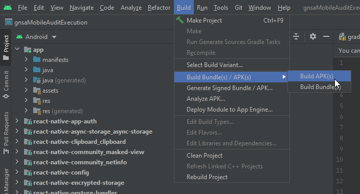

When build is completed, notification will be shown with `Locate` link that will take you to generated `*.apk` file.

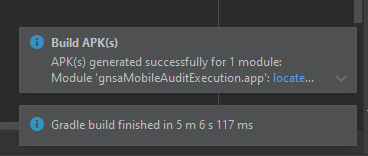

Or navigate manually to the folder where apk files are generated for different stages:
`gnsa-mobile-audit-execution\android\app\build\outputs\apk`

# iOS build

## Prerequisites

Due to application based on react-native 0.64.1, there are specific prerequisits for building this app for iOS:

* Xcode 12
* CocoaPods 1.10
* Node 12

For signing iOS app you'll also need to request from your manager:
* *.p12 file with certificate and keystore and a password for it
* *.mobileprovision file

## Double click *.p12 file to add it into your Keychain Access

You will be asked for the password for this file:  

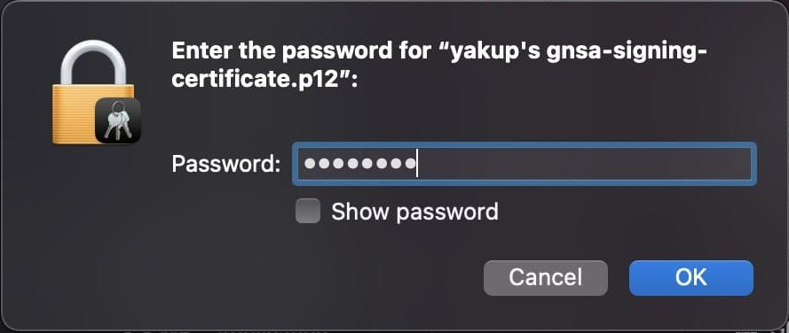

## Install dependencies

First from the root folder of the project, run:

```sh
yarn install
```

or

```sh
npm install
```
depending on your package manager.

Then, from the `ios` folder, run:
```
pod install
```

## Import your *.mobileprovision file

Launch XCode and open the project from `ios` folder. On `Signing & Capabilities` tab locate `Provisioning Profile` field and import your `*.mobileprovision` file:

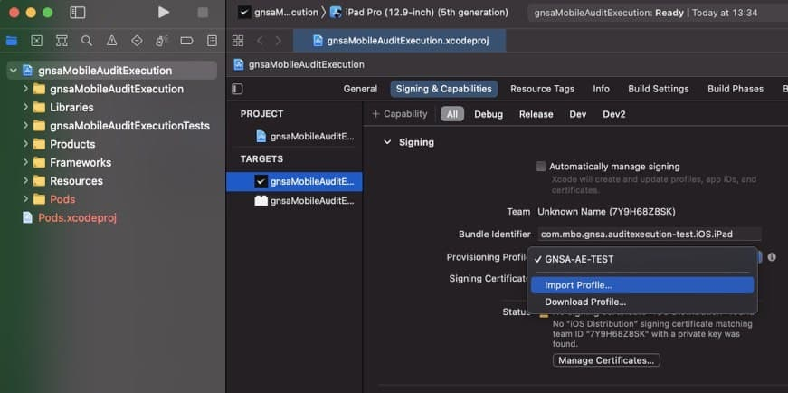

## Select target environment for the build (DEV1, DEV2, QA, etc.)

From the `Product` tab locate `Scheme` submenu and select target environment for the builded application.  
For adding new environments refer to https://git.daimler.com/GNSA/gnsa-mobile-audit-execution/pull/33

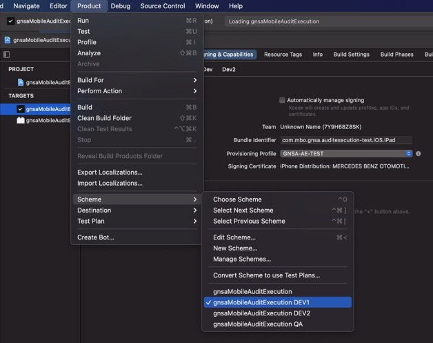

## Select target device for the build

Select "Any iOS Device (arm64, armv7)":

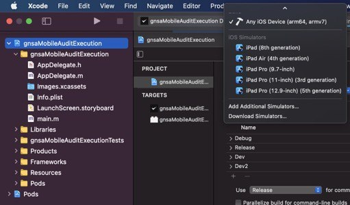

## Archive the app

Fom the `Product` tab, select the `Archive` option to build and archive the app.  

Make sure your project is selected, otherwise `Archive` option will be grayed out.

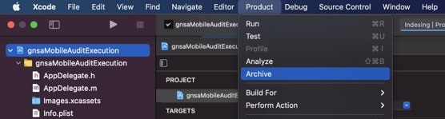

During the end of the process, you might be asked to enter the password to your keychain.

By default this password is matching your MacOS account password - make sure to click `Always Allow` or be ready to enter the
password multiple times during archive process.
The keychain password sometimes might be out of sync with your MacOS account password - if that's the case and the password you use to login in your MacOS is not valid for XCode codesign, refer to https://support.apple.com/guide/keychain-access/if-you-need-to-update-your-keychain-password-kyca2429/mac for instructions.

## Distribute the app

After archive is complete, make sure it's selected and hit the `Distribute` button:

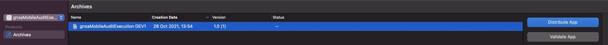

When asked for distribution method, select `Enterprise`:

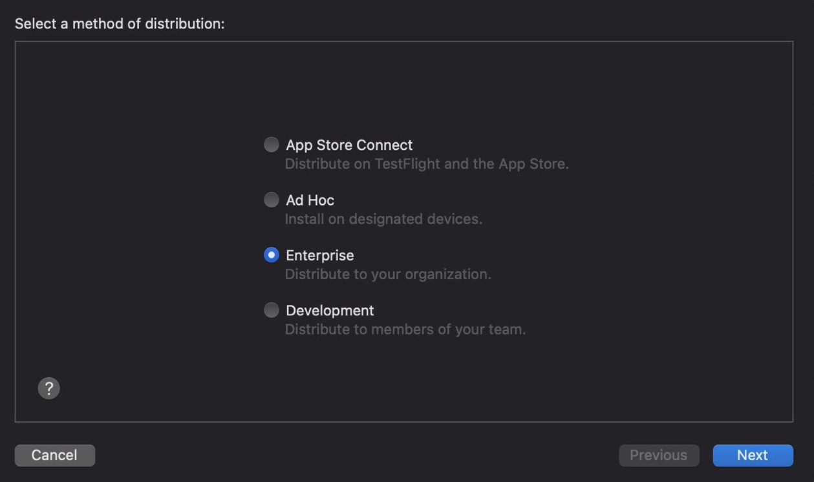

When asked for distribution options, make sure that no option is selected; deselect `Rebuild from BitCode` if it's selected

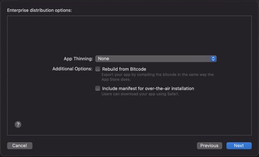

When asked for certificate, select `GNSA-AE-TEST` - should match the one used in your `*.mobileprovision` file

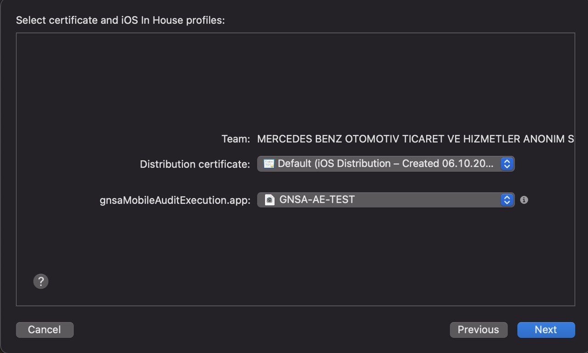

After that you will be asked for the location to save your distribution artifacts - `*.ipa` file in particular

# Upload file to your stage environment

Login to the target stage (DEV1, DEV2, QA, etc.) with the user of `Administrator` role.  
Locate `Mobile App` view under `Administration` screen: 

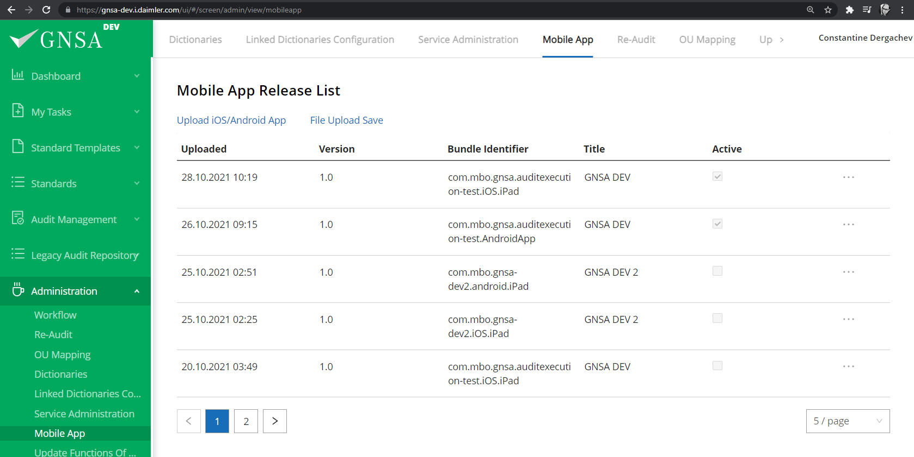

Hit `Upload iOS/Android App` button; popup will be shown:

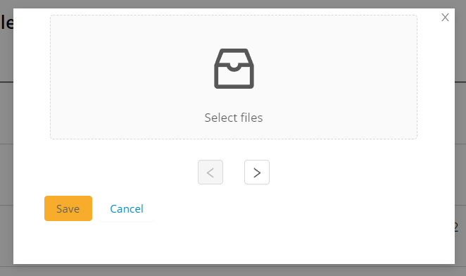

Through this popup, locate and upload `*.apk` file for Android build or `*.ipa` file for iOS build and click save.

A new row will appear with your upload, click `...` menu and hit `Enable` button to make this build active for this specific stage.

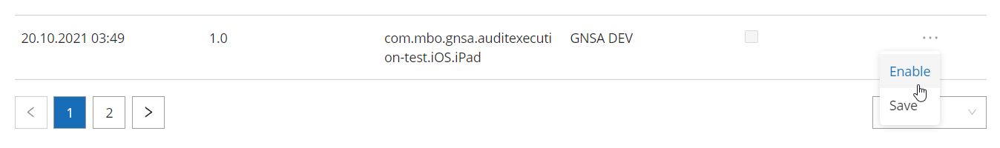

After that checkbox should appear as checked in `Active` column for this build
